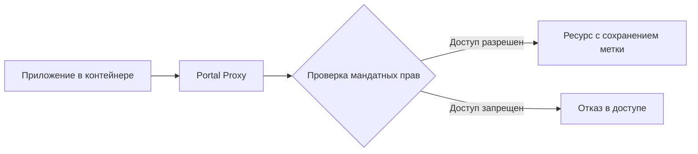

## Хождение по мукам совместимости

Каждый, кто работал в крупных организациях, особенно связанных с безопасностью, наверняка сталкивался с этой проблемой: IT-отдел не спешит обновлять рабочие станции до последней версии ОС. И не потому, что сисадмины ленивы, а потому, что каждое обновление в защищенной среде — это огромная головная боль с сертификациями, проверками и потенциальными проблемами совместимости.

Я помню тот день, когда мне на стол легло техническое задание: "Разработать решение для запуска современных приложений на сертифицированных версиях Astra Linux без нарушения режима безопасности и без обновления базовой системы". Это казалось почти противоречивым требованием — как заставить программу, которая требует свежих библиотек, работать в окружении, где эти библиотеки заморожены на уровне на уровне прошлых версий ОС?

## Контейнеры в мире Astra Linux: вызов принят

В мире общедоступных дистрибутивов ответ прост — Docker, Flatpak, Snap. Но когда речь идет о защищенных системах, всё становится на порядок сложнее. Можно ли совместить песочницу изолированного приложения с мандатным разграничением доступа? Как проконтролировать доступ контейнера к ресурсам, если сам контейнер, по сути, является изоляцией, а как контролировать целостность контейнера?

"Давай посмотрим на подход Flatpak," — сказал тогда мой технический руководитель. "Но адаптируем его под Astra."

Так началась работа над AstraFlathub — системой, которая сейчас позволяет запускать новейшие приложения на сертифицированных версиях Astra Linux, не ломая безопасность и не требуя глобальных обновлений.

## Как работает AstraFlathub: технологический разбор полетов

### Анатомия "машины времени" для приложений

Технически AstraFlathub — это не просто порт Flatpak для Astra Linux. Это полноценная адаптация концепции контейнеризации приложений с учетом особенностей защищенной операционной системы.

Основу нашего решения составляют три ключевых компонента:

1. **Базовое окружение (Runtime)** — среда выполнения, содержащая все необходимые библиотеки
2. **Среда разработки (SDK)** — инструменты для создания приложений
3. **Система контейнеризации и распространения** — механизмы изоляции и доставки приложений

Но главное отличие от стандартного Flatpak — интеграция с Parsec (подсистемой мандатного контроля доступа Astra Linux). Мы буквально проложили защищенный туннель между изолированной средой приложения и защищенной ОС, сохраняя метки безопасности и контроль доступа.

### "Трюк" с пакетами: как мы избежали пересборки всего мира

Один из самых интересных технических аспектов проекта — метод создания базового окружения. Вместо того чтобы собирать всё из исходников (что заняло бы месяцы работы), мы реализовали подход, который я в шутку называю "пакетным пылесосом".

```bash
# Упрощенная версия нашего "пакетного пылесоса"
function extract_packages() {
    local TARGET_DIR="$1"
    shift
    for package in "$@"; do
        echo "Извлекаем пакет: $package"
        apt-get download "$package"
        dpkg-deb -x "${package}*.deb" "$TARGET_DIR"
    done
}
```

Этот подход позволил нам гарантировать, что все компоненты имеют правильные версии и все заплатки безопасности из репозиториев Astra Linux, при этом создавая изолированное окружение.

### Когда 2+2=5: синергия контейнеризации и мандатного доступа

Самой сложной частью оказалась интеграция Flatpak с системой безопасности Astra. Стандартная песочница Flatpak использует namespaces и seccomp для изоляции, но они не "знают" ничего о мандатных метках.

Мы создали систему прокси-доступа, где все обращения из контейнера к ресурсам хост-системы проходят через специальный портал, сохраняющий метки безопасности.



Это позволило нам получить "лучшее из двух миров": изоляцию приложения от системы и при этом полноценное сохранение модели безопасности.

## Практический эффект: кейсы из жизни

### Сценарий 1: Современный браузер на старой системе

В одной из государственных структур стояла задача использовать современный браузер с поддержкой новых протоколов безопасности, но при этом ОС нельзя было обновлять из-за сроков пересертификации.

Решение:
- Мы упаковали Firefox последней версии в Flatpak-контейнер
- Настроили проброс сертификатов из системы в контейнер
- Обеспечили корректную работу с мандатными метками для сохраняемых файлов

Результат: пользователи получили современный браузер, который корректно работал с защищенными ресурсами и соблюдал все политики безопасности.

### Сценарий 2: Разработка под новую платформу

Разработчикам требовалось создавать приложения для новой версии Astra, но разворачивать всю инфраструктуру на рабочих машинах было нецелесообразно.

Решение:
- Создали SDK-контейнер с инструментами разработки для новой платформы
- Настроили совместное использование каталогов с кодом между хост-системой и контейнером
- Реализовали механизм тестового запуска приложений в изолированной среде

Результат: разработчики смогли создавать и тестировать приложения для новой платформы, не меняя основную рабочую среду.

## Технические изюминки проекта

### Многослойная файловая система

Одно из самых интересных технических решений — использование OSTree для создания многослойной файловой системы. Это позволяет хранить несколько версий окружения, экономя дисковое пространство за счет хранения только измененных файлов.

```
Структура хранения слоев:
/var/lib/flatpak/runtime/org.astra.mainPlatform/x86_64/1.8
└── active
    ├── files -> ../../../.../files
    └── metadata
```

Благодаря этому механизму мы обеспечиваем атомарные обновления — новая версия приложения или runtime становится доступна только после успешного завершения всех операций обновления.

### "Умная" система порталов

Для безопасного взаимодействия с хост-системой мы разработали расширенную систему порталов, которая не только ограничивает доступ, но и адаптируется к мандатной модели.

Например, стандартный portal для выбора файлов в Flatpak предоставляет доступ только к конкретному выбранному файлу. Мы расширили эту функциональность, добавив проверку мандатных меток и автоматическую установку корректных меток для создаваемых файлов.

```python
# Псевдокод обработки запроса на открытие файла
def handle_file_open_request(app_id, file_path):
    # Стандартная проверка Flatpak
    if not is_allowed_by_flatpak_policy(app_id, file_path):
        return DENIED

    # Дополнительная проверка Parsec
    app_level = get_app_security_level(app_id)
    file_level = get_file_security_level(file_path)

    if not parsec_access_check(app_level, file_level, "read"):
        return DENIED

    # Предоставляем доступ с правильными мандатными атрибутами
    return provide_access_with_labels(file_path, app_level)
```

## Уроки и выводы

Работа над AstraFlathub показала, что даже в строго регламентированных ИТ-средах можно найти баланс между безопасностью и современными технологиями. Ключевые выводы:

1. **Изоляция не противоречит безопасности** — правильно спроектированная система контейнеризации может усилить защищенность, а не ослабить её.

2. **Переиспользование компонентов экономит ресурсы** — вместо пересборки всех библиотек, можно использовать существующие пакеты, гарантируя совместимость и безопасность.

3. **Модульный подход оправдывает себя** — разделение на runtime, SDK и application позволяет обновлять только нужные компоненты, минимизируя риски.

## Как попробовать AstraFlathub

Если вас заинтересовал проект, вот краткая инструкция по установке:

```bash
# Установка базовых компонентов
sudo apt install flatpak flatpak-builder

# Добавление репозитория AstraFlathub
flatpak remote-add --if-not-exists astraflatpak http://astraflathub.devos.astralinux.ru/repo.flatpakrepo

# Установка окружений
flatpak install astraflatpak org.astra.mainPlatform
flatpak install astraflatpak org.astra.Gtk  # для GTK-приложений
flatpak install astraflatpak org.astra.Qt   # для Qt-приложений

# Поиск доступных приложений
flatpak remote-ls astraflatpak
```

## Что дальше?

В планах развития AstraFlathub:

1. Расширение экосистемы готовых приложений
2. Улучшение инструментов для упаковки существующих приложений
3. Интеграция с центром управления Astra Linux для централизованного управления Flatpak-приложениями
4. Поддержка отечественных процессорных архитектур (Байкал, Эльбрус)

## Заключение

Проект AstraFlathub наглядно демонстрирует, что даже в мире защищенных операционных систем есть место для инноваций. Сочетание изоляции приложений и мандатного разграничения доступа создает уникальную технологию, которая позволяет организациям с высокими требованиями к безопасности пользоваться современными приложениями без компромиссов.

Как инженер, работающий над этим проектом, я убежден, что будущее за гибридными решениями, сочетающими классические подходы к безопасности с современными технологиями контейнеризации. AstraFlathub — это первый шаг в этом направлении, и я рад быть частью команды, создающей эту технологию.

---

*Автор: Вадим Корниенков, младший инженер-программист, РусБИТех-Астра*
